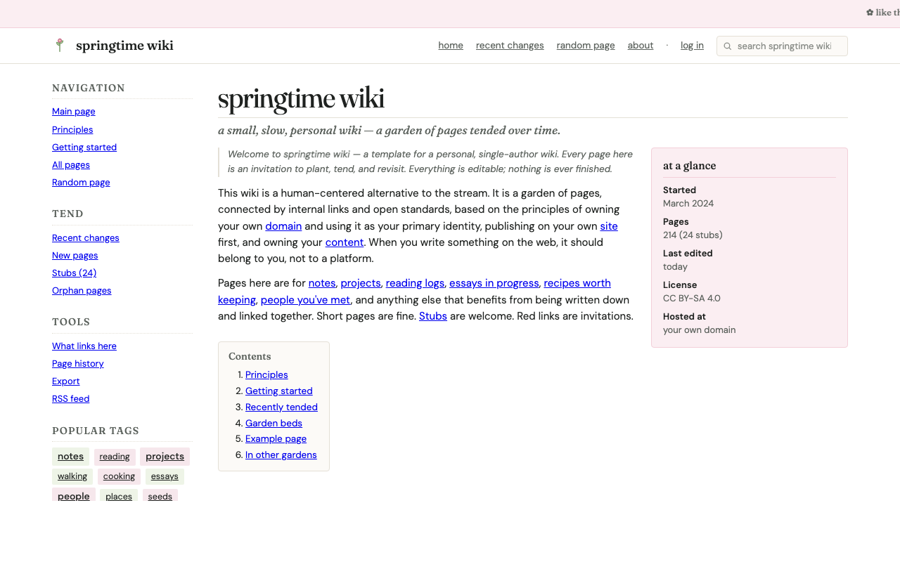

# springtime-wiki

a small, slow, personal wiki — a garden of pages tended over time. left-rail nav, in-line content, classic-Wikipedia-meets-cottage-core feel.



**[view live →](https://demos.penjurupikiran.com/springtime-wiki/)**

---

## what it's good for

- a personal knowledge garden ("digital garden")
- a fan-wiki for a small project / hobby / oc
- documentation that wants to feel handwritten, not corporate
- anywhere you want a **personal** wiki feel without the weight of MediaWiki / TiddlyWiki / Notion

---

## using it

1. copy `index.html` into your own project
2. open it in your editor — all layout + CSS is inline, no build step
3. find the navigation list and replace the page titles with your own
4. find the main content area and write your wiki page
5. for additional pages, copy the file (e.g. `principles.html`, `notes.html`) and edit the content; update the navigation in each file to link the new pages

it's a static layout, not a wiki engine — so each page is its own HTML file. that's deliberate: it forces you to **write fewer, denser pages** rather than churning out drafts.

---

## customize

- **colors:** search the `<style>` block for `#` (hex codes) — there are only ~6 colors, swap them for your palette
- **fonts:** the layout uses [Lora](https://fonts.google.com/specimen/Lora) for body and [Inter](https://fonts.google.com/specimen/Inter) for nav/labels (or whatever the layout shipped with — check the `<link href="https://fonts.googleapis.com/...">` line in `<head>`). Swap to whatever you like
- **structure:** the left rail, "at a glance" right card, and "popular tags" footer are all in one HTML file — rearrange freely

---

## license

[CC BY 4.0](../LICENSE) — **attribution + linkback required.** Drop this somewhere visible on your site (footer is fine):

```html
<a href="https://penjurupikiran.com">layout by penjuru pikiran</a>
```
